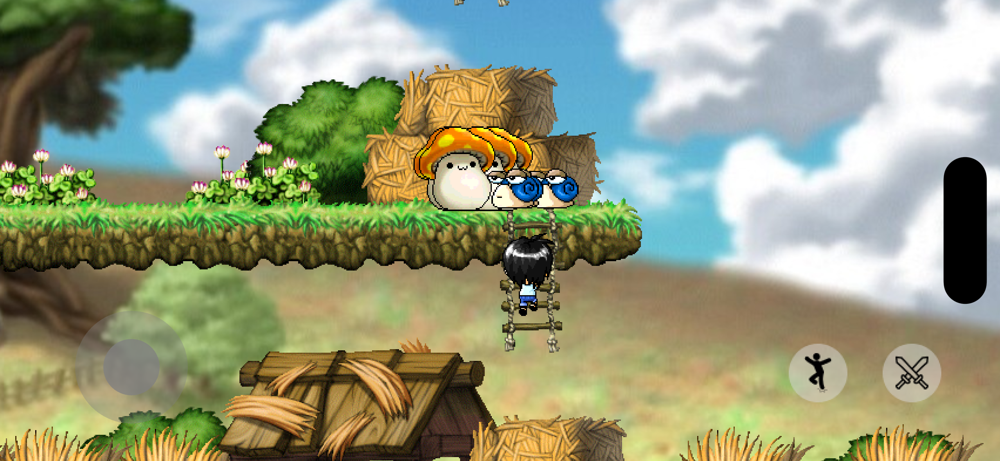

# Flutter MapleStory

Flutter MapleStory 是一款使用 **Flutter** 和 **Flame** 套件開發的 2D 橫向捲軸遊戲，靈感來源於韓國 Nexon 經典遊戲《楓之谷》 (MapleStory)。本專案致力於**跨平台**重現遊戲中的經典角色與場景，並增添許多互動功能，如攻擊、跳躍、行走、爬繩、爬梯等。

## 截圖




## 專案特色

- **開發環境**: 使用 Flutter SDK 3.24.2 開發。
- **跨平台**: 支援 Web、Android、iOS、MacOS 等平台。
    - **Web、PC 平台**: 玩家可以使用鍵盤控制角色，方向鍵移動，空白鍵跳躍，Ctrl 鍵攻擊。
    - **行動裝置**: 提供 HUD（螢幕按鈕）介面供玩家操作，實現與 Web 版本相同的功能。
- **遊戲功能**:
    - 玩家角色可以執行攻擊、跳躍、行走、爬繩、爬梯子等動作。
    - 怪物會在固定地點出現，並自動追尋玩家角色。
    - 怪物在被攻擊時會顯示被擊效果，並在生命耗盡後呈現死亡效果。
- **地圖編輯**: 使用 [Tiled](https://www.mapeditor.org/) 進行地圖設計，精確還原楓之谷的經典場景。
- **精靈圖製作**: 使用 [Gif to sprite sheet](https://ezgif.com/gif-to-sprite) 來製作角色和怪物的動畫。

## 使用工具

- [**Gif to sprite sheet**](https://ezgif.com/gif-to-sprite): 將 GIF 轉換為精靈圖表格，方便動畫處理與整合。
- [**Tiled**](https://www.mapeditor.org/): 開源地圖編輯工具，用於製作遊戲地圖與碰撞邊界設定。

## 使用資源

- [**地圖資源**](https://maplestory.wiki/GMS/72/map?worldMap=WorldMap10): 使用楓之谷 Wiki 提供的地圖資料，模擬經典的遊戲場景。
- [**角色 & 怪物資源**](https://maplestory.studio/): 提供角色和怪物的設計與動畫資料，忠實還原遊戲中的視覺效果。

## 如何運行專案

1. 確保安裝了 Flutter SDK 版本 3.24.2 或以上。
2. Clone 此專案至本地端：
    
    ```bash
    git clone https://github.com/LucyYeung/flutter_maplestory.git
    ```
    
3. 進入專案資料夾並執行以下指令來安裝相依套件：
    
    ```bash
    flutter pub get
    ```
    
4. 使用以下指令啟動遊戲：
    
    ```bash
    flutter run
    ```
    

## 未來開發計畫

- 增加更多怪物種類。
- 增添更多地圖與關卡設計。
- 增強遊戲音效與背景音樂。
- 增加玩家與怪物互動效果，如掉落物、經驗值系統等。
